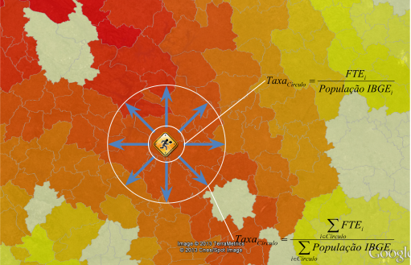

```{r setup, include=FALSE}
options(htmltools.dir.version = FALSE)
library(knitr)
knitr::opts_chunk$set(warning = FALSE, message = FALSE)
# options(knitr.table.format = "html")
library(tidyverse)
library(gt)
library(fontawesome) # from github: https://github.com/rstudio/fontawesome
```

layout: true

<div class="my-footer"><span>lgsilvaesilva.github.io/ufopest306</span></div>

<!-- this adds the link footer to all slides, depends on my-footer class in css-->

---
name: xaringan-title
class: center, middle, inverse
background-image: url(img/rome_map.png)
background-size: cover

# _.fancy[Todos os caminhos <del>levam</del> <ins>me levaram</ins> a Roma]_
## .subtitleinline[.fancy[passeio aleatório de um Estatístico até a ONU/FAO]]

.medium[Luís Silva e Silva | EST306 - Profissão e Mercado | Agosto 2021]

<!-- this ends up being the title slide since seal = FALSE-->

---

class: right, middle
background-color: #f3f3f3ff


### Find me at...

[`r fa(name = "twitter")` @lgsilvaesilva](http://twitter.com/lgsilvaesilva)  
[`r fa(name = "github")` @lgsilvaesilva](http://github.com/lgsilvaesilva)  
[`r fa(name = "linkedin")` @lgsilvaesilva](https://www.linkedin.com/in/lgsilvaesilva/)  
[`r fa(name = "link")` lgsilvaesilva.github.io](https://lgsilvaesilva.github.io)


---
name: agenda
class: left, top
background-image: url(img/pen_yellow.jpg)
background-size: cover

# .right[.fancy[Objetivos]]

.pull-rightnote[
1. .large[.fancy[A decisão de fazer Estatística]]

2. .large[.fancy[O que é ser Estatístico]]

3. .large[.fancy[Minha trajetória na Estatística: .saltinline[soft] e .heatinline[hard] skills]]

4. .large[.fancy[O que eu faço na FAO]]
]

---
class: left, bottom
background-image: url(img/direction.jpeg)
background-size: cover

## .fancy[Qual direção devo seguir?]
--

## .fancy[Decisão binária?]

--
## .fancy[Decisão pra toda vida?]

<!-- https://unsplash.com/photos/LVC3OO3ihA0?utm_source=unsplash&utm_medium=referral&utm_content=creditShareLink -->

---
name: decisao
class: left, middle

### .left[.heatinline[.fancy[Como tomei a minha decisão]]]
--

#### O que eu sabia
--

+ `r fa(name = "thumbs-up")` Me dava bem com disciplinas de exatas: Matemática, Física, <del>Química</del>.

+ Automaticamente a sociedade já te pressiona a fazer alguma Engenharia. Mas eu não curtia a ideia `r fa(name = "thumbs-down")`.

+ Fazer Matemática? Virar professor? `r fa(name = "thumbs-down")`

+ `r fa(name = "thumbs-up")` Gostava de Geografia.
--


#### O que eu .heatinline[não] sabia
--

+ Prof. de Matemática do 2 ano do EM apresentou a Estatística no finalzinho do ano `r fa(name = "laugh-wink")`

+ Um amigo que morava em BH me falou sobre o curso

+ Li sobre o curso em um livreto que a gente ganhava quando fazia vestibular

--

.center[.fancy[.heat["Entendi" o que era Estatística e decido ser Estatístico]]]

---
class: center, middle, inverse

.large[.fancy[.salt[O que é ser Estatístico?]]]

---
class: center, middle
background-image: url(img/toolbox.jpeg)
background-size: cover

```{css, echo = F}
.bg_karl {
  position: relative;
  z-index: 1;
}

.bg_karl::before {    
      content: "";
      background-image: url('img/toolbox.jpeg');
      background-size: cover;
      position: absolute;
      top: 0px;
      right: 0px;
      bottom: 0px;
      left: 0px;
      opacity: 0.15;
      z-index: -1;
}
```

---
class: center, middle, bg_karl

# .large[.fancy[.saltinline[Uma caixa de ferramenta infinita]]]

<!-- https://unsplash.com/photos/NL_DF0Klepc?utm_source=unsplash&utm_medium=referral&utm_content=creditShareLink -->

---
class: center, middle, bg_karl

.pull-left[
#_.fancy[.saltinline["The best thing about being a statistician is that you get to play in everyone's backyard."]]_
]

.pull-right[
.center[


__John Tukey (1915 - 2000)__

]
]

---
name: minha_trajetoria
class: center, middle
background-image: url(img/maps.jpg)
background-size: cover

# .large[.fancy[Passeio Aleatório <br> de um Estatístico]]


---
name: linha_tempo
class: left, middle
background-color: #f3f3f3ff

# .fancy[.saltinline[Linha do tempo]]

.center[

]

---
class: left, middle, inverse

## Graduação (2007 - 2010)

.pull-left[

+ Muita Matemática (Cálculo IV)

+ Várias disciplinas do DCC 
  + Estrutura de dados
  + Programação
  + Teoria de Filas
  + Programação Linear (Otimização)

+ Estágio - CAEd

+ Monitor: Probabilidade e Est. Computationcal

+ Conheço &rarr; Odeio &rarr; Amo &rarr; R

]

.pull-right[
.center[


]
]

```{css, echo = F}
.bg_brain {
  position: relative;
  z-index: 1;
}

.bg_brain::before {    
      content: "";
      background-image: url('img/brain02.png');
      background-size: cover;
      position: absolute;
      top: 0px;
      right: 0px;
      bottom: 0px;
      left: 0px;
      opacity: 0.15;
      z-index: -1;
}
```

---
class: left, middle, bg_brain,inverse

## .fancy[Graduação + Estágio + Monitoria]

.pull-left[
## .heatinline[.fancy[Hard skills]]

+ .fancy[.heatinline[Manipulação de grande bases de dados]]

+ .fancy[.heatinline[Análise de dados]]

+ Aprendo SPSS

+ Teoria de Resposta ao Item

+ Estatística Multivariada

+ .fancy[.heatinline[Aprendo R]]

+ .fancy[.heatinline[Probabilidade]]

]

.pull-right[
## .saltinline[.fancy[Soft skills]]

+ Relacionamento profissional

+ Hierarquia institucional

+ .fancy[.saltinline[Desenvolvimento emocional]]

+ .fancy[.saltinline[Compartilhar conhecimento]]

+ .fancy[.saltinline[Colaboração]]

]

---
name: linha_tempo2
class: left, middle
background-color: #f3f3f3ff

# .fancy[.saltinline[Linha do tempo]]

.center[

]

---
class: right, top
background-image: url(img/ambulancia02.jpeg)
background-size: cover

<!-- https://unsplash.com/photos/vGu08RYjO-s?utm_source=unsplash&utm_medium=referral&utm_content=creditShareLink -->
<!-- https://unsplash.com/photos/V2hZ1VNsZJE?utm_source=unsplash&utm_medium=referral&utm_content=creditShareLink -->

.pull-right[
# .fancy[.fatinline[Mestrado: Plataforma Arauca]]

.fancy[.acid[Qual a distância que um indivíduo deve percorrer até que alcance uma região onde possa ter um atendimento médico?]]

]

---
class: left, middle, inverse

## .fancy[.acidinline[Mestrado: Plataforma Arauca]]

.pull-left[

+ Medicina Intensiva

+ Minas Gerais

+ Taxa Nacional: ⋍ 3 por 100 mil habitantes.

+ Todas as especialidades médicas

+ Todos os municípios do Brasil (~5570)
]

.pull-right[
.center[


]
]

---
class: left, middle, inverse

## .fancy[.acidinline[Mestrado: Plataforma Arauca]]

.pull-left[

+ Medicina Intensiva

+ Minas Gerais

+ Taxa Nacional: ⋍ 3 por 100 mil habitantes.

+ Todas as especialidades médicas

+ Todos os municípios do Brasil (~5570)
]

.pull-right[
.center[



]
]

---
class: left, middle, inverse

## .fancy[.acidinline[Mestrado: Plataforma Arauca]]

.pull-left[

+ Medicina Intensiva

+ Minas Gerais

+ Taxa Nacional: ⋍ 3 por 100 mil habitantes.

+ Todas as especialidades médicas

+ Todos os municípios do Brasil (~5570)
]

.pull-right[
.center[


]
]

---
class: left, middle, inverse

## .fancy[.acidinline[Mestrado: Pesquisa]]

.pull-left[

+ .heatinline[Título]: Novas ferramentas para visualização georreferenciadas de dados: uma integração entre R e Google Maps.

+ .heatinline[Pacote]: aRouca

+ Mapa de Carência
]

.pull-right[
.center[


]
]

---
class: left, middle, inverse

## .fancy[.acidinline[Mestrado: Prêmio SUS - 2013]]


.center[


]

---
class: left, middle, bg_brain,inverse

## .fancy[Mestrado + Projetos]

.pull-left[
## .heatinline[.fancy[Hard skills]]

+ .fancy[.heatinline[Método ágil de desenvolvimento]]

+ .fancy[.heatinline[Análise de dados georreferenciados]]

+ Java, Javascript, HTML, SVG

+ Desenvolvimento de pacotes em R

+ .fancy[.heatinline[Aprendo + R]]

+ .fancy[.heatinline[Aprofundamento teórico]]

]

.pull-right[
## .saltinline[.fancy[Soft skills]]

+ .fancy[.saltinline[Empatia]]

+ .fancy[.saltinline[Resiliência]]

+ .fancy[.saltinline[Desenvolvimento EMOCIONAL +]]

+ .fancy[.saltinline[Compartilhar conhecimento +]]

+ .fancy[.saltinline[Colaboração +]] 

+ Escrita

]

---
name: linha_tempo3
class: left, middle
background-color: #f3f3f3ff

# .fancy[.saltinline[Linha do tempo]]

.center[

]

---
class: left, top, inverse
background-image: url(img/phd.jpeg)
background-size: cover

.pull-left[

# .fancy[.saltinline[Doutorado]]

+ .large[.fancy[.saltinline[Programa SUS]]]
  + Qual a origem dos meus pacientes e quais tratamentos eles fazem?
  
  + Quais os destinos dos pacientes residentes da minha cidade e os tipos de tratamento que eles fazem?

+ .large[.fancy[.saltinline[InfoSAS]]]
  + Detecção de <del>fraude</del> <ins>anomalias</ins> no SUS.

+ .large[.fancy[.saltinline[Simon Fraser University]]]
]


---
class: left, top, inverse

# .fancy[.saltinline[Doutorado: Programa SUS]] 

+ Desenvolvido em R/[shiny](https://shiny.rstudio.com/) para o Ministério da Saúde.

.center[

]

---
class: left, top

# .fancy[.saltinline[Doutorado: InfoSAS]] 

.pull-left[
+ ⋍ 5500 cidades no Brasil.

+ 6000 estabelecimentos de saúde.

+ 5000 conjuntos de procedimentos.

+ 3 anos de dados mensais.

+ Desenvolvimento de algoritmos (⋍ 15) para detecção de anomalias nas séries históricas do SUS.

+ Desenvolvimento de relatórios (folha A4) para a visualização dos dados e resultados dos algoritmos.

]

.pull-right[
.center[

]]

---
class: left, top, inverse

# .fancy[.saltinline[Doutorado: InfoSAS]] 

.pull-left[

+ Média

+ Mediana

+ Taxas (proporção)

+ Desvio-Padrão

+ Desvio Mediano Absoluto (MAD)

+ Percentil

+ Janela móvel

+ Bayes Empírico

]

.pull-right[
.center[

]]

---
class: left, top, inverse

# .fancy[.saltinline[InfoSAS: relatórios]]

.pull-left[
.center[


]]

.pull-right[
.center[

]]

---
class: left, top, inverse

# .fancy[.saltinline[InfoSAS: relatórios]]

.pull-left[
.center[


]]

.pull-right[
.center[

]]

---
class: left, middle, inverse

## .fancy[.acidinline[Doutorado: Pesquisa]]

.pull-left[

+ .heatinline[Título]: COWORDS: a probabilistic model for text visualization.

+ Como visualizar uma sequência de nuvem de palavras de forma que seja .fancy[.heatinline[compacta]], .fancy[.heatinline[sem sobreposição das palavras]], e que palavras que aparecem em mais de uma nuvem devem ficar na .fancy[.heatinline[mesma posição]] ao longo das nuvens.

+ .fancy[.heatinline[COWORDS]] é baseado em uma distribuição de probabilidade em que as configurações mais prováveis de serem obervadas desta distribuição são aquelas que seguem os princípios.

]

.pull-right[
.center[

]
]

---
class: left, middle, inverse

## .fancy[.acidinline[Doutorado: Pesquisa]]

.pull-left[

+ .heatinline[Título]: COWORDS: a probabilistic model for text visualization.

+ Como visualizar uma sequência de nuvem de palavras de forma que seja .fancy[.heatinline[compacta]], .fancy[.heatinline[sem sobreposição das palavras]], e que palavras que aparecem em mais de uma nuvem devem ficar na .fancy[.heatinline[mesma posição]] ao longo das nuvens.

+ .fancy[.heatinline[COWORDS]] é baseado em uma distribuição de probabilidade em que as configurações mais prováveis de serem obervadas desta distribuição são aquelas que seguem os princípios.

]

.pull-right[
.center[

]
]

---
class: left, middle, inverse

## .fancy[.acidinline[Doutorado: Pesquisa]]

.pull-left[

+ .heatinline[Título]: COWORDS: a probabilistic model for text visualization.

+ Como visualizar uma sequência de nuvem de palavras de forma que seja .fancy[.heatinline[compacta]], .fancy[.heatinline[sem sobreposição das palavras]], e que palavras que aparecem em mais de uma nuvem devem ficar na .fancy[.heatinline[mesma posição]] ao longo das nuvens.

+ .fancy[.heatinline[COWORDS]] é baseado em uma distribuição de probabilidade em que as configurações mais prováveis de serem obervadas desta distribuição são aquelas que seguem os princípios.

]

.pull-right[
$$\pi(\mathbf{W})\propto\exp\left\{-\sum_{t=1}^{T}\sum_{i\sim j}{\alpha_{tij}^{2}}\right\}\prod_{t=1}^{T}\prod_{i \neq j}\mathbb{1}_{\left[S_{tij}\right]}$$
]

---
class: left, middle, inverse
background-image: url(img/bear-at-sfu.jpeg)
background-size:cover

---
class: left, middle, inverse

## .fancy[.acidinline[Tentando a sorte]]

.pull-left[

+ Tema de pesquisa

+ Momento certo

+ Networking - Luís Fernando

+ Busca da oportunidade (e-mail)

]

.pull-right[
.center[

]
]

---
class: left, middle, inverse

## .fancy[.acidinline[Simon Fraser University - SFU]]

.pull-left[

+ ⋍ 4 meses na Simon Fraser

+ Muita pesquisa e desafios

+ Muito aprendizado

+ Inglês

+ Abertura de uma nova porta
]

.pull-right[
.center[

]
]

---
class: left, middle, inverse
background-image: url(img/sfu-quarto.png)
background-size:cover

---
class: left, middle, inverse
background-image: url(img/sfu-turismo.png)
background-size:cover

---
class: left, middle, inverse
background-image: url(img/food-canada.jpeg)
background-size:contain

---
class: left, middle, bg_brain,inverse

## .fancy[Doutorado + Projetos + Canadá]

.pull-left[
## .heatinline[.fancy[Hard skills]]

+ .fancy[.heatinline[Programar c++]]

+ .fancy[Computação Paralela]

+ .fancy[.heatinline[Análise de dados + + +]]

+ .fancy[.heatinline[Aprendo + R + + +]]

+ .fancy[.heatinline[Aprofundamento teórico + + + + +]]

+ .fancy[.heatinline[Inglês]]

]

.pull-right[
## .saltinline[.fancy[Soft skills]]

+ .fancy[.saltinline[Pensamento Organizado - Lógico]] 

+ .fancy[.saltinline[Comunicação]]

+ .fancy[.saltinline[Empatia +]]

+ .fancy[.saltinline[Resiliência + +]]

+ .fancy[.saltinline[Desenvolvimento EMOCIONAL + + +]]

+ .fancy[.saltinline[Colaboração + + ]] 

+ .fancy[.saltinline[Globalizado]] 
]

---
class: left, middle, inverse
background-image: url(img/fao-logo2.svg), url(img/fao01.jpeg)
background-size: 50%, 100%
background-position: 50% 0%, 0% 100%

---
class: left, middle, inverse

# .fancy[.salt[O que a FAO faz?]]

--

.center[

]

---
class: left, middle, inverse

## .fancy[.salt[Como entrei na FAO?]]

--

1. Um amigo que trabalha na FAO me contou sobre uma vaga para estatístico <a href="https://twitter.com/vidigal_br?ref_src=twsrc%5Etfw" class="twitter-follow-button" data-show-count="false">Follow @vidigal_br</a><script async src="https://platform.twitter.com/widgets.js" charset="utf-8"></script>

2. Submissão do CV para candidatura

3. Entrevista I
  + .fancy[.heatinline[hard skills]]
  + Falar sobre as experiências acadêmicas e profissionais
  
4. Teste de estatística, programação em R: 72 horas para entregar o relatório.

5. Entrevista II
  + .fancy[.saltinline[soft skills]]
  + "Descreva uma situação em que você teve algum conflito profissional"
  + "Como fez para resolvê-lo?"

---
class: left, top, inverse
background-image: url(img/oqfao.jpeg)
background-size: cover

.pull-left[
## .fancy[.salt[O que um Estastístico faz na FAO?]]
]

---
class: left, middle, inverse

.pull-left[
## .fancy[.salt[O que um Estastístico faz na FAO?]]
]

.pull-right[

+ Obtenção e padronização dos dados nas codificações internacionais

+ Análise de dados faltantes: imputação através de modelos estatístico

+ Detecção de _outliers_ e proposta de correção dos valores atípicos

+ Relatórios estatístico

+ Previsão: consumo de carne nos próximos 10 anos

+ Estimação: número de pessoas que vivem em insegurança alimentar por país, região, ...

+ [Visite FAOSTAT](http://www.fao.org/faostat/en/#data)

]

---
class: center, bottom, inverse
background-image: url(img/ano1fao.jpeg)
background-position: 100% 40%
background-size: cover

### .fancy[.acid[&nbsp;&nbsp;&nbsp;&nbsp;&nbsp;&nbsp;Primeiro ano na FAO!]]

---
class: left, middle, inverse

.pull-left[
## .fancy[.acid[Primeiro ano na FAO!]]
]

.pull-right[

+ Aprender a chegar na minha sala

+ Aprender as principais siglas da Organização

+ Inglês com diferentes sotaques

+ Multicultural

+ Alimentação

]

---
class: left, middle, inverse

#### .fancy[.acid[Primeiro ano na FAO: .fatinline[meu principal produto]]]

.left-column[

+ Obtenção dos dados

+ Codificação dos países e commodities

+ Tratamento de dados faltantes

+ Tratamento de valores discrepantes

+ Integração com o Sistema da FAO

]

.right-column[

]

---
class: center, bottom, inverse
background-image: url(img/ano1fao.jpeg)
background-position: 100% 40%
background-size: cover

### .fancy[.acid[&nbsp;&nbsp;&nbsp;&nbsp;&nbsp;&nbsp;.heatinline[Segundo] ano na FAO!]]

---
class: center, bottom, inverse
background-image: url(img/ds.jpeg)
background-size: cover

---
class: left, middle, inverse

.pull-left[
## .fancy[.acid[.heatinline[Segundo] ano na FAO!]]
]

.pull-right[

+ .heatinline[.fancy[Primeiro]] Cientista de Dados

+ Mineração de Texto

+ Google Cloud

+ Modelo de Tópicos

]

---
class: left, middle, inverse

.pull-left[
#### .fancy[.acid[.heatinline[Paris21]: os países levam em conta o uso de estatística na tomada de decisão?]]
]

.pull-right[

+ ~3000 documentos texto (leis e politicas)

+ ~200 países

+ 7 idiomas

+ 33 anos de dado

]

---
class: left, middle, inverse

#### .fancy[.acid[.heatinline[Paris21]: produto]]

<iframe src="https://foodandagricultureorganization.shinyapps.io/paris21/" width="100%" height="75%" frameBorder = "0", loading = "lazy"></iframe> 

---
class: left, middle, inverse

.pull-left[
#### .fancy[.acid[.heatinline[COVID19 + Social Unrest]: onde e quando estão ocorrendo disordem devido a pandemia?]]
]

.pull-right[

+ ~4 milhões de tweets da impressa

+ ~150 países

+ 5 idiomas

+ Real time

]

---
class: left, middle, inverse

#### .fancy[.acid[.heatinline[COVID 19 & Social Unrest]: produto]]

<iframe src="https://foodandagricultureorganization.shinyapps.io/sentiment/" width="100%" height="75%" frameBorder = "0", loading = "lazy"></iframe> 

---
class: left, middle, inverse

.pull-left[
#### .fancy[.acid[.heatinline[Food Prices]: qual o impacto da pandemia nos preços dos alimentos? Podemos antecipar quando haverá aumento?]]
]

.pull-right[

+ ~14 commodities

+ ~218 países

+ Preços diários sendo monitorado

]

---
class: left, middle, inverse

#### .fancy[.acid[.heatinline[Food Prices]: produto]]

<iframe src="https://foodandagricultureorganization.shinyapps.io/dl_foodprices/" width="100%" height="75%" frameBorder = "0", loading = "lazy"></iframe> 

---
class: left, middle, inverse

## .fancy[DataLab webpage]

.center[
<a href="http://www.fao.org/datalab/website/web/"> </a>
]

http://www.fao.org/datalab/website/web/

---
class: center, bottom, inverse
background-image: url(img/viewfao.jpeg)
background-size: cover

---
class: center, bottom, inverse
background-image: url(img/cafefao.jpeg)
background-size: cover


---
class: left, middle, bg_brain,inverse

## .fancy[FAO]

.pull-left[
## .heatinline[.fancy[Hard skills]]

+ .fancy[.heatinline[Google cloud]]

+ .fancy[.heatinline[Solr DB - NoSQL]]
]

.pull-right[
## .saltinline[.fancy[Soft skills]]

+ .fancy[.saltinline[Comunicação + +]]

+ .fancy[.saltinline[Resiliência + + +]]

+ .fancy[.saltinline[Trabalhar sob alta pressão]] 

+ .fancy[.saltinline[Desenvolvimento EMOCIONAL + + +]]

+ .fancy[.saltinline[Colaboração + + ]] 

+ .fancy[.saltinline[Globalizado + + ]] 
]

---
class: left, middle, bg_brain,inverse
## .fancy[Trajetória até aqui...]

.pull-left[
## .heatinline[.fancy[Hard skills]]

+ .fancy[.heatinline[Teoria Estatística]]: Probabilidade + Inferência + Modelagem

+ .fancy[.heatinline[Programação]]: lógica de programação + R

+ Prática de .fancy[.heatinline[análise de dados]] (colocar a mão na massa)

+ .fancy[.heatinline[Inglês]]

]

.pull-right[
## .saltinline[.fancy[Soft skills]]

+ .fancy[.saltinline[Comunicação]]

+ .fancy[.saltinline[Compartilhar]]: .fancy[.heatinline[ciclo vicioso]]

+ .fancy[.saltinline[Resiliência]]

+ .fancy[.saltinline[Gerenciamento EMOCIONAL]]

+ .fancy[.saltinline[Curiosidade + Ação]]: .fancy[.heatinline[caprendizado]]

+ .fancy[.saltinline[Respeito]]

]

---

class: right, middle


### Obrigado!

[`r fa(name = "twitter")` @lgsilvaesilva](http://twitter.com/lgsilvaesilva)  
[`r fa(name = "github")` @lgsilvaesilva](http://github.com/lgsilvaesilva)  
[`r fa(name = "linkedin")` @lgsilvaesilva](https://www.linkedin.com/in/lgsilvaesilva/)  
[`r fa(name = "link")` lgsilvaesilva.github.io](https://lgsilvaesilva.github.io)

---
name: xaringan-title
class: center, middle, inverse
background-image: url(img/rome_map.png)
background-size: cover

# _.fancy[Todos os caminhos <del>levam</del> <ins>me levaram</ins> a Roma]_
## .subtitleinline[.fancy[passeio aleatório de um Estatístico até a ONU/FAO]]

.medium[Luís Silva e Silva | EST306 - Profissão e Mercado | Agosto 2021]


